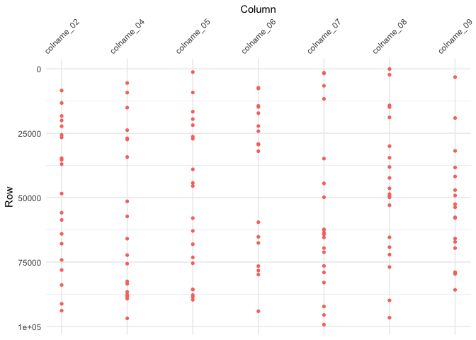

example.R
================
Garrick Aden-Buie
2018-06-13

First, we need some fake data. The following functions make fake data,
with a core data structure of columns named `colname_NN` and ID columns
`id_NN`. The data are randomly generated as integers, doubles,
characters and factors, and the IDs are drawn from integer or character
labels.

A single big tibble is created and then copied to a new tibble where it
is “corrupted” in a few rows and
columns.

``` r
make_char   <- function(iter, len) sapply(1:iter, function(x) paste0(sample(letters, len, replace = TRUE), collapse = ""))
make_factor <- function(iter, len) sapply(1:iter, function(x) factor(sample(letters[1:len], 1), levels = letters[1:len]))

make_core_fake <- function(n, rows = 100) {
  x <- list()
  for (i in 1:n) {
    type <- sample(c("int", "dbl", "char", "factor"), 1)
    x[[sprintf("colname_%02d", i)]] <- switch(
      type,
      int    = sample(-50:50, rows, replace = TRUE),
      dbl    = runif(rows, 0, 1) * 10^(sample(1:5, 1)),
      char   = make_char(rows, 6),
      factor = make_factor(rows, 10)
    )
  }
  tibble::as_tibble(x)
}

factorize <- function(x) {
  x <- as.integer(x)
  div <- seq_len(abs(x))[-1]
  all_fct <- div[x %% div == 0L]
  factors <- c()
  flag <- TRUE
  while(flag) {
    this <- all_fct[x %% all_fct == 0L]
    if (!length(this)) {
      flag <- FALSE
    } else {
      factors <- c(factors, this[1])
      x <- x / this[1]
    }
  }
  return(factors)
}

add_ids <- function(df, n_ids = NULL) {
  x <- list()
  rows <- nrow(df)
  n <- if (is.null(n_ids)) factorize(rows) else n_ids
  types <- sample(c("int", "char"), length(n), replace = TRUE)
  for (i in 1:length(n)) {
    x[[sprintf("id_%02d", i)]] <- switch(
      types[i],
      int = sample(1:rows, n[i]),
      char = make_char(n[i], 6)
    )
  }
  df_id <- if (is.null(n_ids)) {
    expand.grid(x)
  } else {
    x <- lapply(x, function(k) rep(k, ceiling(rows/length(k)))[1:rows])
  }
  x <- dplyr::bind_cols(df_id, df)
  tibble::as_tibble(x)
}

corrupt_values <- function(df, ..., n_rows = nrow(df)/5) {
  vars <- rlang::enexprs(...)
  vars <- tidyselect::vars_select(names(df), !!!vars)
  for (var in vars) {
    df[[var]][sample(1:nrow(df), n_rows)] <- sample(df[[var]], n_rows)
  }
  df
}
```

Here is the fake data with 10 data columns, 2 ID columns and 10^5 rows.

``` r
x <- make_core_fake(10, 10^5) %>%
  add_ids(n_ids = c(50^4, 300))
y <- corrupt_values(x, dplyr::contains("colname"), n_rows = 20)
```

Here I additionally remove some columns from each side and change data
types

``` r
x <- x[, sample(-3:-13, 1)]
y <- y[, sample(-3:-13, 2)]
y_ints <- sapply(y, is.integer)
y_ints[1:2] <- rep(FALSE, 2)
if (any(y_ints)) {
  y[[which(y_ints)[1]]] <- as.character(y[[which(y_ints)[1]]])
}
```

And scramble the order but add grouping to both … this doesn’t work yet.
It starts to get a whole lot more complicated when the number of rows
differ.

``` r
# x <- group_by(x, id_01, id_02) %>% {.[sample(1:nrow(.), nrow(.)), ]}
# y <- group_by(y, id_01, id_02) %>% {.[sample(1:nrow(.), ceiling(nrow(.) * 0.95)), ]}

tibble:::print.tbl_df(x)
```

    # # A tibble: 100,000 x 11
    #    id_01  id_02 colname_01 colname_02 colname_04 colname_05 colname_06
    #    <chr>  <int> <chr>           <dbl>      <int>      <dbl>      <int>
    #  1 phrayr 65858 epbtha          65.5         -10     39044.         35
    #  2 vvduay  2027 sfdkpw          99.3         -26     93104.        -39
    #  3 wghoie 10686 hvsitr          25.7           7     34475.         -3
    #  4 piftte 28757 fdspcd          66.0          -9     18838.         19
    #  5 cscwee 53767 gxtmlk          75.5          -9      7078.        -33
    #  6 mkzsvs 88576 xjoobx           7.80         18     50653.         36
    #  7 glkbek 76955 ozxukd          72.6           9     50846.         24
    #  8 twocjp 60623 dxgmuk          18.4          -2     68778.         -7
    #  9 oxilzd 75934 iapqkh          36.8         -10     18702.         -2
    # 10 asxihf 28038 bdcqkp          51.3          41     90407.         37
    # # ... with 99,990 more rows, and 4 more variables: colname_07 <chr>,
    # #   colname_08 <int>, colname_09 <fct>, colname_10 <chr>

``` r
tibble:::print.tbl_df(y)
```

    # # A tibble: 100,000 x 10
    #    id_01  id_02 colname_02 colname_03 colname_04 colname_05 colname_06
    #    <chr>  <int>      <dbl> <chr>           <int>      <dbl>      <int>
    #  1 phrayr 65858      65.5  -31               -10     39044.         35
    #  2 vvduay  2027      99.3  21                -26     93104.        -39
    #  3 wghoie 10686      25.7  -45                 7     34475.         -3
    #  4 piftte 28757      66.0  -42                -9     18838.         19
    #  5 cscwee 53767      75.5  49                 -9      7078.        -33
    #  6 mkzsvs 88576       7.80 15                 18     50653.         36
    #  7 glkbek 76955      72.6  -44                 9     50846.         24
    #  8 twocjp 60623      18.4  31                 -2     68778.         -7
    #  9 oxilzd 75934      36.8  18                -10     18702.         -2
    # 10 asxihf 28038      51.3  20                 41     90407.         37
    # # ... with 99,990 more rows, and 3 more variables: colname_07 <chr>,
    # #   colname_08 <int>, colname_09 <fct>

We can compare the two data frames with `tidy_diff()`.

``` r
library(grkmisc)
system.time(
  z <- tidy_diff(x, y)
)
```

    #    user  system elapsed 
    #   0.073   0.004   0.148

This creates a `tidy_diff` object with `print`, `summary` and `plot`
methods

``` r
> print(z)
```

    Showing differences in first 5 columns...
    
    # A tibble: 2 x 22
      variable   set   `8414` `13259` `18295` `20018` `22273` `25650` `26614`
      <chr>      <chr>  <dbl>   <dbl>   <dbl>   <dbl>   <dbl>   <dbl>   <dbl>
    1 colname_02 x       74.5    15.0    70.8    66.2    35.1   82.1     70.5
    2 colname_02 y       69.5    83.5    24.0    95.8    47.2    3.77    72.4
    # ... with 13 more variables: `34685` <dbl>, `35318` <dbl>, `36988` <dbl>,
    #   `48417` <dbl>, `55856` <dbl>, `58655` <dbl>, `64067` <dbl>,
    #   `67877` <dbl>, `74163` <dbl>, `78105` <dbl>, `83909` <dbl>,
    #   `91212` <dbl>, `93855` <dbl>
    
    # A tibble: 2 x 22
      variable   set   `5478` `9236` `15055` `23791` `26954` `27415` `34240`
      <chr>      <chr>  <int>  <int>   <int>   <int>   <int>   <int>   <int>
    1 colname_04 x        -41    -44     -38     -30      -1      46     -21
    2 colname_04 y         19     -2     -50       4     -32      29      -8
    # ... with 13 more variables: `51437` <int>, `57291` <int>, `65933` <int>,
    #   `72302` <int>, `75636` <int>, `82517` <int>, `83454` <int>,
    #   `86576` <int>, `87682` <int>, `88100` <int>, `88413` <int>,
    #   `89221` <int>, `96864` <int>
    
    # A tibble: 2 x 22
      variable   set   `1234` `9176` `16635` `19505` `21849` `26336` `27123`
      <chr>      <chr>  <dbl>  <dbl>   <dbl>   <dbl>   <dbl>   <dbl>   <dbl>
    1 colname_05 x     75238. 87096.  96539.  31186.  57792.  40174.  29129.
    2 colname_05 y     13314. 21286.  63879.   3385.  62517.  21458.   1929.
    # ... with 13 more variables: `39006` <dbl>, `44301` <dbl>, `45463` <dbl>,
    #   `57951` <dbl>, `62919` <dbl>, `68096` <dbl>, `73194` <dbl>,
    #   `75482` <dbl>, `85637` <dbl>, `85655` <dbl>, `87831` <dbl>,
    #   `88592` <dbl>, `89649` <dbl>
    
    # A tibble: 2 x 20
      variable   set   `7337` `7610` `14371` `14771` `17192` `22195` `24209`
      <chr>      <chr>  <int>  <int>   <int>   <int>   <int>   <int>   <int>
    1 colname_06 x        -31    -16     -11      40      -4       8     -23
    2 colname_06 y         -6    -35      35     -40      22     -29      12
    # ... with 11 more variables: `29191` <int>, `29239` <int>, `29380` <int>,
    #   `31974` <int>, `59540` <int>, `65227` <int>, `67587` <int>,
    #   `76559` <int>, `78289` <int>, `79859` <int>, `94105` <int>
    
    # A tibble: 2 x 22
      variable   set   `1484` `1786` `6582` `11641` `34832` `44456` `49842`
      <chr>      <chr> <chr>  <chr>  <chr>  <chr>   <chr>   <chr>   <chr>  
    1 colname_07 x     ymjcfu ywkwbe cchkau gvytjv  ljmwuv  ofqpxt  aofute 
    2 colname_07 y     ummxqs xbugpk uqynjp rpkzhk  bylujm  myorkx  fbqugf 
    # ... with 13 more variables: `62347` <chr>, `62427` <chr>, `63561` <chr>,
    #   `64273` <chr>, `65461` <chr>, `69575` <chr>, `71186` <chr>,
    #   `76500` <chr>, `79032` <chr>, `82964` <chr>, `92254` <chr>,
    #   `95538` <chr>, `99290` <chr>
    
    ... with differences in 2 more columns: `colname_08`, `colname_09`

``` r
> summary(z)
```

``` 
── Comparison Summary ──────────────────────────────────────────────────────────────────────────────────────────────────────────────────────────────────────────────────
● Dimensions
    set     rows  cols
  1 x     100000    11
  2 y     100000    10

● 'x' has 2 unique columns: `colname_01`, `colname_10`
● 'y' has 1 unique column: `colname_03`
● There are 135 differing values across 135 rows:
     variable   state    miss_count `misses (row id)`                       
   1 colname_02 diff             20 8414, 13259, 18295, 20018, 22273, 25650…
   2 colname_04 diff             20 5478, 9236, 15055, 23791, 26954, 27415,…
   3 colname_05 diff             20 1234, 9176, 16635, 19505, 21849, 26336,…
   4 colname_06 diff             18 7337, 7610, 14371, 14771, 17192, 22195,…
   5 colname_07 diff             20 1484, 1786, 6582, 11641, 34832, 44456, …
   6 colname_08 diff             20 66, 2275, 14185, 14838, 18848, 29999, 3…
   7 colname_09 diff             17 3199, 19090, 31854, 38293, 41781, 47063…
   8 id_01      same              0 ""                                      
   9 id_02      same              0 ""                                      
  10 colname_03 unique_x         NA ""                                      
  11 colname_01 unique_y         NA ""                                      
  12 colname_10 unique_y         NA ""                                      
```

``` r
> plot(z)
```

<!-- -->

You can also pull out a list of comparisons by differing columns by
subsetting the to the `.$tidy` element of the tidy diff object.

``` r
> z$tidy[1]
```

    $colname_02
    # A tibble: 20 x 6
       variable   value.x value.y miss_index id_01  id_02
       <chr>        <dbl>   <dbl>      <int> <chr>  <int>
     1 colname_02   74.5    69.5        8414 tactic 51674
     2 colname_02   15.0    83.5       13259 hmaobf 82090
     3 colname_02   70.8    24.0       18295 ihuikv 77250
     4 colname_02   66.2    95.8       20018 npeapv 40991
     5 colname_02   35.1    47.2       22273 nhxdsh 54127
     6 colname_02   82.1     3.77      25650 aguqzc 72961
     7 colname_02   70.5    72.4       26614 edskci 35268
     8 colname_02   67.8    59.4       34685 aispyu 50907
     9 colname_02   17.7    68.5       35318 nomqpn 40991
    10 colname_02   14.5    64.9       36988 jxeahv 86820
    11 colname_02    6.75   47.1       48417 ayvigc 71432
    12 colname_02   93.8     5.14      55856 ogplub  1999
    13 colname_02   87.6    62.8       58655 rftyax 20557
    14 colname_02   88.9    41.2       64067 pqjigw 23136
    15 colname_02   40.7    48.1       67877 knzcsc 82816
    16 colname_02   24.7    69.6       74163 prcfvd 46287
    17 colname_02   82.8    92.8       78105 euxksw 23558
    18 colname_02   19.0    59.2       83909 ddwzra 34580
    19 colname_02   19.3    20.5       91212 mdehwv 38570
    20 colname_02   64.0    30.4       93855 yfxhtg 63408

The tidy diff object also includes a tidy dataframe with “diff”, “same”
or “unique” column values.

``` r
> z$diff
```

    # A tibble: 12 x 4
       variable   state    miss_count misses    
       <chr>      <chr>         <int> <list>    
     1 colname_02 diff             20 <int [20]>
     2 colname_04 diff             20 <int [20]>
     3 colname_05 diff             20 <int [20]>
     4 colname_06 diff             18 <int [18]>
     5 colname_07 diff             20 <int [20]>
     6 colname_08 diff             20 <int [20]>
     7 colname_09 diff             17 <int [17]>
     8 id_01      same              0 <int [0]> 
     9 id_02      same              0 <int [0]> 
    10 colname_03 unique_x         NA <int [0]> 
    11 colname_01 unique_y         NA <int [0]> 
    12 colname_10 unique_y         NA <int [0]> 

In terms of size

``` r
> pryr::object_size(x)
```

    29.2 MB

``` r
> pryr::object_size(y)
```

    17.2 MB

``` r
> pryr::object_size(z)
```

    29.4 kB

### Mismatched Rows

``` r
x2 <- x[sort(sample(1:nrow(x), floor(nrow(x) * 0.9952))), ]
y2 <- y[sort(sample(1:nrow(y), floor(nrow(y) * 0.9921))), ]

z2 <- tidy_diff(x2, y2, group_vars = c("id_01", "id_02"))
summary(z2)
```

    # ── Comparison Summary ──────────────────────────────────────────────────────────────────────────────────────────────────────────────────────────────────────────────────
    # ● Dimensions
    #     set    rows  cols
    #   1 x2    99520    11
    #   2 y2    99210    10
    # 
    # ● 'x2' has 2 unique columns: `colname_01`, `colname_10`
    # ● 'y2' has 1 unique column: `colname_03`
    # ● There are 8995 differing values across 1399 rows:
    #      variable   state    miss_count `misses (row id)`                       
    #    1 colname_02 diff           1286 44, 268, 308, 397, 472, 636, 663, 778, …
    #    2 colname_04 diff           1285 44, 268, 308, 397, 472, 636, 663, 778, …
    #    3 colname_05 diff           1286 44, 268, 308, 397, 472, 636, 663, 778, …
    #    4 colname_06 diff           1284 44, 268, 308, 397, 472, 636, 663, 778, …
    #    5 colname_07 diff           1285 44, 268, 308, 397, 472, 636, 663, 778, …
    #    6 colname_08 diff           1286 44, 66, 268, 308, 397, 472, 636, 663, 7…
    #    7 colname_09 diff           1283 44, 268, 308, 397, 472, 636, 663, 778, …
    #    8 id_01      same              0 ""                                      
    #    9 id_02      same              0 ""                                      
    #   10 colname_03 unique_x         NA 44, 268, 308, 397, 472, 636, 663, 778, …
    #   11 colname_01 unique_y         NA 99521, 99522, 99523, 99524, 99525, 9952…
    #   12 colname_10 unique_y         NA 99521, 99522, 99523, 99524, 99525, 9952…

``` r
z2$diff
```

    # # A tibble: 15 x 4
    #    variable   state    miss_count misses       
    #    <chr>      <chr>         <int> <list>       
    #  1 colname_02 diff           1286 <int [1,286]>
    #  2 colname_04 diff           1285 <int [1,285]>
    #  3 colname_05 diff           1286 <int [1,286]>
    #  4 colname_06 diff           1284 <int [1,284]>
    #  5 colname_07 diff           1285 <int [1,285]>
    #  6 colname_08 diff           1286 <int [1,286]>
    #  7 colname_09 diff           1283 <int [1,283]>
    #  8 id_01      same              0 <int [0]>    
    #  9 id_02      same              0 <int [0]>    
    # 10 _row.x     same            478 <int [478]>  
    # 11 _row.y     same            788 <int [788]>  
    # 12 _row.z     same              0 <int [0]>    
    # 13 colname_03 unique_x         NA <int [788]>  
    # 14 colname_01 unique_y         NA <int [478]>  
    # 15 colname_10 unique_y         NA <int [478]>

``` r
z2$tidy[1]
```

    # $colname_02
    # # A tibble: 1,286 x 8
    #    variable   value.x value.y miss_index miss_index.x miss_index.y id_01 
    #    <chr>        <dbl>   <dbl>      <int>        <int>        <int> <chr> 
    #  1 colname_02    9.99      NA         44           44           NA yxbutq
    #  2 colname_02   53.3       NA        268          268           NA ypcuee
    #  3 colname_02   38.7       NA        308          308           NA iwdmye
    #  4 colname_02   11.7       NA        397          397           NA owhvdz
    #  5 colname_02   82.7       NA        472          472           NA nyqkpg
    #  6 colname_02   97.8       NA        636          636           NA fhwqnf
    #  7 colname_02   50.3       NA        663          663           NA csqvnu
    #  8 colname_02   99.4       NA        778          778           NA ozatyt
    #  9 colname_02   84.8       NA        969          969           NA kgtrgs
    # 10 colname_02   10.9       NA       1113         1113           NA fehiil
    # # ... with 1,276 more rows, and 1 more variable: id_02 <int>
