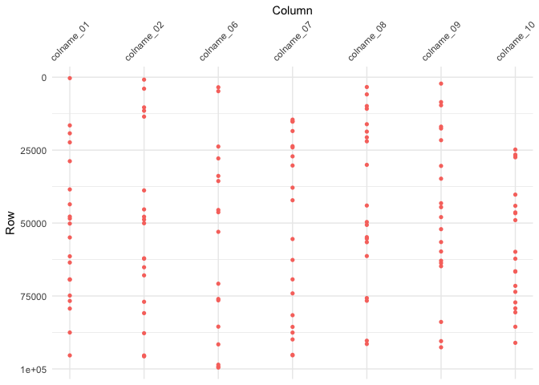

readme.R
================
Garrick Aden-Buie
2018-06-13

First, we need some fake data. The following functions make fake data,
with a core data structure of columns named `colname_NN` and ID columns
`id_NN`. The data are randomly generated as integers, doubles,
characters and factors, and the IDs are drawn from integer or character
labels.

A single big tibble is created and then copied to a new tibble where it
is “corrupted” in a few rows and
columns.

``` r
make_char   <- function(iter, len) sapply(1:iter, function(x) paste0(sample(letters, len, replace = TRUE), collapse = ""))
make_factor <- function(iter, len) sapply(1:iter, function(x) factor(sample(letters[1:len], 1), levels = letters[1:len]))

make_core_fake <- function(n, rows = 100) {
  x <- list()
  for (i in 1:n) {
    type <- sample(c("int", "dbl", "char", "factor"), 1)
    x[[sprintf("colname_%02d", i)]] <- switch(
      type,
      int    = sample(-50:50, rows, replace = TRUE),
      dbl    = runif(rows, 0, 1) * 10^(sample(1:5, 1)),
      char   = make_char(rows, 6),
      factor = make_factor(rows, 10)
    )
  }
  tibble::as_tibble(x)
}

factorize <- function(x) {
  x <- as.integer(x)
  div <- seq_len(abs(x))[-1]
  all_fct <- div[x %% div == 0L]
  factors <- c()
  flag <- TRUE
  while(flag) {
    this <- all_fct[x %% all_fct == 0L]
    if (!length(this)) {
      flag <- FALSE
    } else {
      factors <- c(factors, this[1])
      x <- x / this[1]
    }
  }
  return(factors)
}

add_ids <- function(df, n_ids = NULL) {
  x <- list()
  rows <- nrow(df)
  n <- if (is.null(n_ids)) factorize(rows) else n_ids
  types <- sample(c("int", "char"), length(n), replace = TRUE)
  for (i in 1:length(n)) {
    x[[sprintf("id_%02d", i)]] <- switch(
      types[i],
      int = sample(1:rows, n[i]),
      char = make_char(n[i], 6)
    )
  }
  df_id <- if (is.null(n_ids)) {
    expand.grid(x)
  } else {
    x <- lapply(x, function(k) rep(k, ceiling(rows/length(k)))[1:rows])
  }
  x <- dplyr::bind_cols(df_id, df)
  tibble::as_tibble(x)
}

corrupt_values <- function(df, ..., n_rows = nrow(df)/5) {
  vars <- rlang::enexprs(...)
  vars <- tidyselect::vars_select(names(df), !!!vars)
  for (var in vars) {
    df[[var]][sample(1:nrow(df), n_rows)] <- sample(df[[var]], n_rows)
  }
  df
}
```

Here is the fake data with 10 data columns, 2 ID columns and 10^5 rows.

``` r
x <- make_core_fake(10, 10^5) %>%
  add_ids(n_ids = c(50^4, 300))
y <- corrupt_values(x, dplyr::contains("colname"), n_rows = 20)
```

Here I additionally remove some columns from each side and change data
types

``` r
x <- x[, sample(-3:-13, 1)]
y <- y[, sample(-3:-13, 2)]
y_ints <- sapply(y, is.integer)
y_ints[1:2] <- rep(FALSE, 2)
if (any(y_ints)) {
  y[[which(y_ints)[1]]] <- as.character(y[[which(y_ints)[1]]])
}
```

And scramble the order but add grouping to both … this doesn’t work yet.
It starts to get a whole lot more complicated when the number of rows
differ.

``` r
# x <- group_by(x, id_01, id_02) %>% {.[sample(1:nrow(.), nrow(.)), ]}
# y <- group_by(y, id_01, id_02) %>% {.[sample(1:nrow(.), ceiling(nrow(.) * 0.95)), ]}

tibble:::print.tbl_df(x)
```

    # # A tibble: 100,000 x 11
    #    id_01  id_02  colname_01 colname_02 colname_03 colname_04 colname_06
    #    <chr>  <chr>       <int>      <dbl> <fct>      <chr>      <fct>     
    #  1 fuqkkc xgkmvb         43     10213. i          shdczr     f         
    #  2 veajpd cifvme          5     29526. d          yokjgk     g         
    #  3 vjublp uqgajv        -12     95967. g          dhbvvn     d         
    #  4 kepsri ftecnf          8     31957. a          bptqth     e         
    #  5 riaanj xecfdk        -39      4903. a          dtfwml     d         
    #  6 ldydwr gybemw          4     69363. a          xhywqp     d         
    #  7 grsvmh dlhpmd        -36      6784. f          htjyvd     e         
    #  8 fregom eysqda         36     35386. i          lbcwai     a         
    #  9 ryhjpw sdpnsc         20     17837. e          skbxtf     d         
    # 10 rcoshf uruuhs        -20     13192. a          sbbfpa     g         
    # # ... with 99,990 more rows, and 4 more variables: colname_07 <dbl>,
    # #   colname_08 <chr>, colname_09 <chr>, colname_10 <int>

``` r
tibble:::print.tbl_df(y)
```

    # # A tibble: 100,000 x 10
    #    id_01  id_02  colname_01 colname_02 colname_05 colname_06 colname_07
    #    <chr>  <chr>  <chr>           <dbl>      <dbl> <fct>           <dbl>
    #  1 fuqkkc xgkmvb 43             10213.       17.3 f               8997.
    #  2 veajpd cifvme 5              29526.      672.  g               4861.
    #  3 vjublp uqgajv -12            95967.       35.8 d               3536.
    #  4 kepsri ftecnf 8              31957.       71.4 e               4315.
    #  5 riaanj xecfdk -39             4903.      662.  d               8097.
    #  6 ldydwr gybemw 4              69363.      327.  d               9885.
    #  7 grsvmh dlhpmd -36             6784.      795.  e               3195.
    #  8 fregom eysqda 36             35386.      695.  a               6263.
    #  9 ryhjpw sdpnsc 20             17837.      838.  d               4553.
    # 10 rcoshf uruuhs -20            13192.      115.  g                359.
    # # ... with 99,990 more rows, and 3 more variables: colname_08 <chr>,
    # #   colname_09 <chr>, colname_10 <int>

We can compare the two data frames with `tidy_diff()`.

``` r
library(grkmisc)
system.time(
  z <- tidy_diff(x, y)
)
```

    #    user  system elapsed 
    #   0.085   0.005   0.141

This creates a `tidy_diff` object with `print`, `summary` and `plot`
methods

``` r
> print(z)
```

    Showing differences in first 5 columns...
    
    # A tibble: 2 x 22
      variable   set   `330` `16519` `19235` `22329` `28785` `38470` `43571`
      <chr>      <chr> <chr> <chr>   <chr>   <chr>   <chr>   <chr>   <chr>  
    1 colname_01 x     -42   -25     -27     -9      26      -17     16     
    2 colname_01 y     -23   -46     49      -19     -25     -43     32     
    # ... with 13 more variables: `47781` <chr>, `48461` <chr>, `50182` <chr>,
    #   `54936` <chr>, `61393` <chr>, `63528` <chr>, `69300` <chr>,
    #   `69400` <chr>, `74850` <chr>, `76700` <chr>, `79315` <chr>,
    #   `87518` <chr>, `95366` <chr>
    
    # A tibble: 2 x 22
      variable   set    `828` `3946` `10345` `11498` `13516` `38808` `45318`
      <chr>      <chr>  <dbl>  <dbl>   <dbl>   <dbl>   <dbl>   <dbl>   <dbl>
    1 colname_02 x     24797.  9291.   1092.  59090.  78357.  27158.   8271.
    2 colname_02 y     27377. 55173.  98222.  36363.   4665.  45675.  28208.
    # ... with 13 more variables: `47822` <dbl>, `48809` <dbl>, `50069` <dbl>,
    #   `62095` <dbl>, `62209` <dbl>, `65157` <dbl>, `67929` <dbl>,
    #   `76989` <dbl>, `80882` <dbl>, `87761` <dbl>, `95395` <dbl>,
    #   `95565` <dbl>, `95682` <dbl>
    
    # A tibble: 2 x 19
      variable   set   `3447` `4785` `23770` `27836` `33844` `35597` `45514`
      <chr>      <chr> <chr>  <chr>  <chr>   <chr>   <chr>   <chr>   <chr>  
    1 colname_06 x     a      j      e       a       g       i       g      
    2 colname_06 y     g      a      d       g       d       g       j      
    # ... with 10 more variables: `46290` <chr>, `53005` <chr>, `70787` <chr>,
    #   `76017` <chr>, `76492` <chr>, `85508` <chr>, `91588` <chr>,
    #   `98549` <chr>, `99210` <chr>, `99538` <chr>
    
    # A tibble: 2 x 22
      variable   set   `14543` `15089` `15235` `18453` `23655` `24064` `27137`
      <chr>      <chr>   <dbl>   <dbl>   <dbl>   <dbl>   <dbl>   <dbl>   <dbl>
    1 colname_07 x       7645.   2272.   5505.   1041.   6359.   3299.   6689.
    2 colname_07 y       6542.   6633.   4426.   2088.   6995.   5131.   4591.
    # ... with 13 more variables: `30277` <dbl>, `37869` <dbl>, `42184` <dbl>,
    #   `55476` <dbl>, `62653` <dbl>, `69303` <dbl>, `74105` <dbl>,
    #   `81590` <dbl>, `85597` <dbl>, `87547` <dbl>, `89892` <dbl>,
    #   `95174` <dbl>, `95341` <dbl>
    
    # A tibble: 2 x 22
      variable   set   `3365` `5891` `9883` `10820` `16112` `18648` `20619`
      <chr>      <chr> <chr>  <chr>  <chr>  <chr>   <chr>   <chr>   <chr>  
    1 colname_08 x     qxxscw dofpbu wogiob oijizc  cyqiwj  pzgcig  axxuco 
    2 colname_08 y     hsqfwz hmpnqc opvihy zpuxqk  popxxq  kzqfjh  wxbdms 
    # ... with 13 more variables: `21973` <chr>, `30041` <chr>, `43989` <chr>,
    #   `49632` <chr>, `50629` <chr>, `54834` <chr>, `55358` <chr>,
    #   `56555` <chr>, `61310` <chr>, `75712` <chr>, `76629` <chr>,
    #   `90329` <chr>, `91455` <chr>
    
    ... with differences in 2 more columns: `colname_09`, `colname_10`

``` r
> summary(z)
```

``` 
── Comparison Summary ──────────────────────────────────────────────────────────────────────────────────────────────────────────────────────────────────────────────────
● Dimensions
    set     rows  cols
  1 x     100000    11
  2 y     100000    10

● 'x' has 2 unique columns: `colname_03`, `colname_04`
● 'y' has 1 unique column: `colname_05`
● 'x' and 'y' have differing data types in 1 column:
    column     x       y        
  1 colname_01 integer character

● There are 137 differing values across 137 rows:
     variable   state    miss_count `misses (row id)`                       
   1 colname_01 diff             20 330, 16519, 19235, 22329, 28785, 38470,…
   2 colname_02 diff             20 828, 3946, 10345, 11498, 13516, 38808, …
   3 colname_06 diff             17 3447, 4785, 23770, 27836, 33844, 35597,…
   4 colname_07 diff             20 14543, 15089, 15235, 18453, 23655, 2406…
   5 colname_08 diff             20 3365, 5891, 9883, 10820, 16112, 18648, …
   6 colname_09 diff             20 2192, 8530, 9627, 16942, 17582, 21597, …
   7 colname_10 diff             20 24803, 26548, 26966, 27456, 40252, 4409…
   8 id_01      same              0 ""                                      
   9 id_02      same              0 ""                                      
  10 colname_05 unique_x         NA ""                                      
  11 colname_03 unique_y         NA ""                                      
  12 colname_04 unique_y         NA ""                                      
```

``` r
> plot(z)
```

<!-- -->

You can also pull out a list of comparisons by differing columns by
subsetting the to the `.$tidy` element of the tidy diff object.

``` r
> z$tidy[1]
```

    $colname_01
    # A tibble: 20 x 6
       variable   value.x value.y miss_index id_01  id_02 
       <chr>        <int> <chr>        <int> <chr>  <chr> 
     1 colname_01     -42 -23            330 wxqrhw eqocio
     2 colname_01     -25 -46          16519 hwrgdn mqlcnp
     3 colname_01     -27 49           19235 izyuam kfnmcq
     4 colname_01      -9 -19          22329 fiyzbi wujmkn
     5 colname_01      26 -25          28785 shodnj lvqkit
     6 colname_01     -17 -43          38470 yrzrgz nokmzb
     7 colname_01      16 32           43571 eeawae facjaq
     8 colname_01     -12 9            47781 dlrzhg psuqes
     9 colname_01     -23 23           48461 vvxnzx eqwduy
    10 colname_01      40 -48          50182 xsrdkk ttfwft
    11 colname_01     -15 8            54936 urkqni mgrlwd
    12 colname_01     -41 -15          61393 xjgijk riziig
    13 colname_01     -35 49           63528 dqxxzf dxboef
    14 colname_01     -16 40           69300 wyooul gsedrj
    15 colname_01     -42 5            69400 cxuofw jqzicz
    16 colname_01      10 38           74850 omzbsk iaklat
    17 colname_01     -27 1            76700 gmbpbv sfeinh
    18 colname_01      44 -26          79315 qnqikx xrokmq
    19 colname_01     -18 -48          87518 zprlbn kloiut
    20 colname_01      45 26           95366 lvvtbz xeefad

The tidy diff object also includes a tidy dataframe with “diff”, “same”
or “unique” column values.

``` r
> z$diff
```

    # A tibble: 12 x 4
       variable   state    miss_count misses    
       <chr>      <chr>         <int> <list>    
     1 colname_01 diff             20 <int [20]>
     2 colname_02 diff             20 <int [20]>
     3 colname_06 diff             17 <int [17]>
     4 colname_07 diff             20 <int [20]>
     5 colname_08 diff             20 <int [20]>
     6 colname_09 diff             20 <int [20]>
     7 colname_10 diff             20 <int [20]>
     8 id_01      same              0 <int [0]> 
     9 id_02      same              0 <int [0]> 
    10 colname_05 unique_x         NA <int [0]> 
    11 colname_03 unique_y         NA <int [0]> 
    12 colname_04 unique_y         NA <int [0]> 

In terms of size

``` r
> pryr::object_size(x)
```

    29.6 MB

``` r
> pryr::object_size(y)
```

    24 MB

``` r
> pryr::object_size(z)
```

    39.3 kB

### Mismatched Rows

``` r
x2 <- x[sort(sample(1:nrow(x), floor(nrow(x) * 0.9952))), ]
y2 <- y[sort(sample(1:nrow(y), floor(nrow(y) * 0.9921))), ]

z2 <- tidy_diff(x2, y2, group_vars = c("id_01", "id_02"))
summary(z2)
```

    # ── Comparison Summary ──────────────────────────────────────────────────────────────────────────────────────────────────────────────────────────────────────────────────
    # ● Dimensions
    #     set    rows  cols
    #   1 x2    99520    11
    #   2 y2    99210    10
    # 
    # ● 'x2' has 2 unique columns: `colname_03`, `colname_04`
    # ● 'y2' has 1 unique column: `colname_05`
    # ● 'x2' and 'y2' have differing data types in 1 column:
    #     column     x2      y2       
    #   1 colname_01 integer character
    # 
    # ● There are 8954 differing values across 1394 rows:
    #      variable   state    miss_count `misses (row id)`                       
    #    1 colname_01 diff           1279 283, 314, 327, 380, 515, 541, 547, 577,…
    #    2 colname_02 diff           1280 283, 314, 380, 515, 541, 547, 577, 825,…
    #    3 colname_06 diff           1277 283, 314, 380, 515, 541, 547, 577, 979,…
    #    4 colname_07 diff           1280 283, 314, 380, 515, 541, 547, 577, 979,…
    #    5 colname_08 diff           1280 283, 314, 380, 515, 541, 547, 577, 979,…
    #    6 colname_09 diff           1278 283, 314, 380, 515, 541, 547, 577, 979,…
    #    7 colname_10 diff           1280 283, 314, 380, 515, 541, 547, 577, 979,…
    #    8 id_01      same              0 ""                                      
    #    9 id_02      same              0 ""                                      
    #   10 colname_05 unique_x         NA 283, 314, 380, 515, 541, 547, 577, 979,…
    #   11 colname_03 unique_y         NA 99521, 99522, 99523, 99524, 99525, 9952…
    #   12 colname_04 unique_y         NA 99521, 99522, 99523, 99524, 99525, 9952…

``` r
z2$diff
```

    # # A tibble: 15 x 4
    #    variable   state    miss_count misses       
    #    <chr>      <chr>         <int> <list>       
    #  1 colname_01 diff           1279 <int [1,279]>
    #  2 colname_02 diff           1280 <int [1,280]>
    #  3 colname_06 diff           1277 <int [1,277]>
    #  4 colname_07 diff           1280 <int [1,280]>
    #  5 colname_08 diff           1280 <int [1,280]>
    #  6 colname_09 diff           1278 <int [1,278]>
    #  7 colname_10 diff           1280 <int [1,280]>
    #  8 id_01      same              0 <int [0]>    
    #  9 id_02      same              0 <int [0]>    
    # 10 _row.x     same            475 <int [475]>  
    # 11 _row.y     same            785 <int [785]>  
    # 12 _row.z     same              0 <int [0]>    
    # 13 colname_05 unique_x         NA <int [785]>  
    # 14 colname_03 unique_y         NA <int [475]>  
    # 15 colname_04 unique_y         NA <int [475]>

``` r
z2$tidy[1]
```

    # $colname_01
    # # A tibble: 1,279 x 8
    #    variable   value.x value.y miss_index miss_index.x miss_index.y id_01 
    #    <chr>        <int> <chr>        <int>        <int>        <int> <chr> 
    #  1 colname_01       7 <NA>           283          283           NA ufeedm
    #  2 colname_01      30 <NA>           314          314           NA utvqsk
    #  3 colname_01     -42 -23            327          327          328 wxqrhw
    #  4 colname_01      16 <NA>           380          380           NA drksab
    #  5 colname_01      12 <NA>           515          515           NA wlzwfk
    #  6 colname_01       1 <NA>           541          541           NA ydhnho
    #  7 colname_01     -28 <NA>           547          547           NA jwpxzl
    #  8 colname_01       3 <NA>           577          577           NA lwweyd
    #  9 colname_01     -18 <NA>           979          979           NA xumobf
    # 10 colname_01       6 <NA>          1033         1033           NA isqdtl
    # # ... with 1,269 more rows, and 1 more variable: id_02 <chr>
