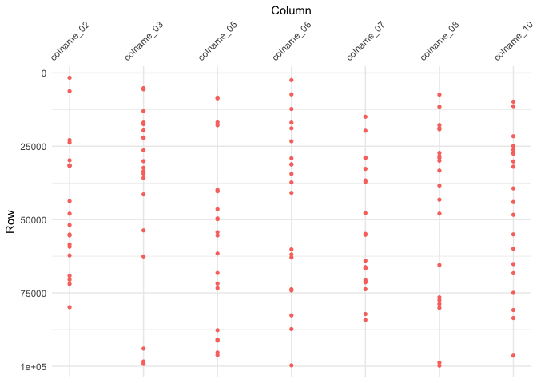

readme.R
================
Garrick Aden-Buie
2018-06-14

  - [Functions to Create Data](#functions-to-create-fake-data)
  - [Example Data](#example-data)
  - [tidy\_diff()](#tidy-diff)
  - [Data Frames with Mismatched
    Rows](#data-frames-with-mismatched-rows)

## Functions to Create Data

First, we need some fake data. The following functions make fake data,
with a core data structure of columns named `colname_NN` and ID columns
`id_NN`. The data are randomly generated as integers, doubles,
characters and factors, and the IDs are drawn from integer or character
labels.

A single big tibble is created and then copied to a new tibble where it
is “corrupted” in a few rows and
columns.

``` r
make_char   <- function(iter, len) sapply(1:iter, function(x) paste0(sample(letters, len, replace = TRUE), collapse = ""))
make_factor <- function(iter, len) sapply(1:iter, function(x) factor(sample(letters[1:len], 1), levels = letters[1:len]))

make_core_fake <- function(n, rows = 100) {
  x <- list()
  for (i in 1:n) {
    type <- sample(c("int", "dbl", "char", "factor"), 1)
    x[[sprintf("colname_%02d", i)]] <- switch(
      type,
      int    = sample(-50:50, rows, replace = TRUE),
      dbl    = runif(rows, 0, 1) * 10^(sample(1:5, 1)),
      char   = make_char(rows, 6),
      factor = make_factor(rows, 10)
    )
  }
  tibble::as_tibble(x)
}

factorize <- function(x) {
  x <- as.integer(x)
  div <- seq_len(abs(x))[-1]
  all_fct <- div[x %% div == 0L]
  factors <- c()
  flag <- TRUE
  while(flag) {
    this <- all_fct[x %% all_fct == 0L]
    if (!length(this)) {
      flag <- FALSE
    } else {
      factors <- c(factors, this[1])
      x <- x / this[1]
    }
  }
  return(factors)
}

add_ids <- function(df, n_ids = NULL) {
  x <- list()
  rows <- nrow(df)
  n <- if (is.null(n_ids)) factorize(rows) else n_ids
  types <- sample(c("int", "char"), length(n), replace = TRUE)
  for (i in 1:length(n)) {
    x[[sprintf("id_%02d", i)]] <- switch(
      types[i],
      int = sample(1:rows, n[i]),
      char = make_char(n[i], 6)
    )
  }
  df_id <- if (is.null(n_ids)) {
    expand.grid(x)
  } else {
    x <- lapply(x, function(k) rep(k, ceiling(rows/length(k)))[1:rows])
  }
  x <- dplyr::bind_cols(df_id, df)
  tibble::as_tibble(x)
}

corrupt_values <- function(df, ..., n_rows = nrow(df)/5) {
  vars <- rlang::enexprs(...)
  vars <- tidyselect::vars_select(names(df), !!!vars)
  for (var in vars) {
    df[[var]][sample(1:nrow(df), n_rows)] <- sample(df[[var]], n_rows)
  }
  df
}
```

## Example Data

Here is the fake data with 10 data columns, 2 ID columns and 10^5 rows.

``` r
x <- make_core_fake(10, 10^5) %>%
  add_ids(n_ids = c(50^4, 300))
y <- corrupt_values(x, dplyr::contains("colname"), n_rows = 20)
```

Here I additionally remove some columns from each side and change data
types

``` r
x <- x[, sample(-3:-13, 1)]
y <- y[, sample(-3:-13, 2)]
y_ints <- sapply(y, is.integer)
y_ints[1:2] <- rep(FALSE, 2)
if (any(y_ints)) {
  y[[which(y_ints)[1]]] <- as.character(y[[which(y_ints)[1]]])
}

tibble:::print.tbl_df(x)
```

    # # A tibble: 100,000 x 11
    #    id_01  id_02 colname_02 colname_03 colname_04 colname_05 colname_06
    #    <chr>  <int>      <dbl> <chr>           <dbl>      <dbl>      <dbl>
    #  1 dxzmyu 10552     1.28   ogryow           7.43    1.40          4.09
    #  2 ljmmkk 25389    29.9    duofff           1.85    8.62          1.21
    #  3 nxynzh   350     0.0319 bsorop           5.29    3.89          8.87
    #  4 hjwgru 20007    51.1    qjttrm           2.70    5.91          7.32
    #  5 dwjylf 23880    45.6    gaxolm           3.60    2.58          1.60
    #  6 virqcb 82213    10.8    rxeiwi           7.77    6.79          5.52
    #  7 wvfrrq 98167    18.3    xmzjmx           9.43    0.531         1.50
    #  8 utusok 91929    68.6    xlkmpl           7.21    0.00598       4.50
    #  9 ioxaky 36852    47.5    neemki           8.23    2.97          6.92
    # 10 xvarcb 12323    12.6    uktamw           2.97    9.49          9.05
    # # ... with 99,990 more rows, and 4 more variables: colname_07 <chr>,
    # #   colname_08 <chr>, colname_09 <chr>, colname_10 <int>

``` r
tibble:::print.tbl_df(y)
```

    # # A tibble: 100,000 x 10
    #    id_01  id_02 colname_01 colname_02 colname_03 colname_05 colname_06
    #    <chr>  <int>      <dbl>      <dbl> <chr>           <dbl>      <dbl>
    #  1 dxzmyu 10552      1547.     1.28   ogryow        1.40          4.09
    #  2 ljmmkk 25389       595.    29.9    duofff        8.62          1.21
    #  3 nxynzh   350      8262.     0.0319 bsorop        3.89          8.87
    #  4 hjwgru 20007      6219.    51.1    qjttrm        5.91          7.32
    #  5 dwjylf 23880      1239.    45.6    gaxolm        2.58          1.60
    #  6 virqcb 82213      3485.    10.8    rxeiwi        6.79          5.52
    #  7 wvfrrq 98167      4530.    18.3    xmzjmx        0.531         1.50
    #  8 utusok 91929      9858.    68.6    xlkmpl        0.00598       4.50
    #  9 ioxaky 36852      2552.    47.5    neemki        2.97          6.92
    # 10 xvarcb 12323      9024.    12.6    uktamw        9.49          9.05
    # # ... with 99,990 more rows, and 3 more variables: colname_07 <chr>,
    # #   colname_08 <chr>, colname_10 <chr>

## Tidy Diff

We can compare the two data frames with `tidy_diff()`.

``` r
library(grkmisc)
system.time(
  z <- tidy_diff(x, y)
)
```

    #    user  system elapsed 
    #   0.088   0.004   0.092

This creates a `tidy_diff` object with `print`, `summary` and `plot`
methods

``` r
> print(z)
```

    Showing differences in first 5 columns...
    
    # A tibble: 2 x 22
      variable   set   `1640` `6235` `22879` `23752` `29796` `31468` `31608`
      <chr>      <chr>  <dbl>  <dbl>   <dbl>   <dbl>   <dbl>   <dbl>   <dbl>
    1 colname_02 x       73.5   73.7    99.5    33.8    34.1    91.2    79.1
    2 colname_02 y       48.3   57.9    57.9    57.2    14.2    89.4    92.3
    # ... with 13 more variables: `31687` <dbl>, `43706` <dbl>, `47984` <dbl>,
    #   `51873` <dbl>, `55101` <dbl>, `55404` <dbl>, `58478` <dbl>,
    #   `59260` <dbl>, `62230` <dbl>, `69179` <dbl>, `70497` <dbl>,
    #   `71963` <dbl>, `79873` <dbl>
    
    # A tibble: 2 x 22
      variable   set   `5202` `5590` `13018` `16936` `17429` `19616` `22037`
      <chr>      <chr> <chr>  <chr>  <chr>   <chr>   <chr>   <chr>   <chr>  
    1 colname_03 x     dtajom girkny kdllgm  raamde  xmdzdu  dxboyr  yolbqo 
    2 colname_03 y     uctwcp gvztmb eihdyf  hfdaox  rhryqk  mzwgxx  yfithn 
    # ... with 13 more variables: `22141` <chr>, `26389` <chr>, `30076` <chr>,
    #   `32348` <chr>, `33552` <chr>, `34327` <chr>, `35816` <chr>,
    #   `41414` <chr>, `53697` <chr>, `62562` <chr>, `94004` <chr>,
    #   `98408` <chr>, `99219` <chr>
    
    # A tibble: 2 x 22
      variable   set   `8405` `8679` `16849` `17830` `39853` `40351` `46476`
      <chr>      <chr>  <dbl>  <dbl>   <dbl>   <dbl>   <dbl>   <dbl>   <dbl>
    1 colname_05 x      7.67    5.49    7.13    2.44    5.07    6.90    4.64
    2 colname_05 y      0.185   9.83    4.12    1.21    8.70    7.32    8.10
    # ... with 13 more variables: `49614` <dbl>, `49887` <dbl>, `54288` <dbl>,
    #   `55410` <dbl>, `61581` <dbl>, `68237` <dbl>, `71826` <dbl>,
    #   `73387` <dbl>, `87734` <dbl>, `90910` <dbl>, `91285` <dbl>,
    #   `95341` <dbl>, `96191` <dbl>
    
    # A tibble: 2 x 22
      variable   set   `2435` `7313` `12286` `16930` `18880` `23293` `29085`
      <chr>      <chr>  <dbl>  <dbl>   <dbl>   <dbl>   <dbl>   <dbl>   <dbl>
    1 colname_06 x      0.102 0.0732    9.20    8.37    2.96    6.32   8.39 
    2 colname_06 y      0.992 9.51      1.98    4.37    6.03    4.07   0.550
    # ... with 13 more variables: `31155` <dbl>, `31194` <dbl>, `34416` <dbl>,
    #   `37332` <dbl>, `40883` <dbl>, `60174` <dbl>, `61891` <dbl>,
    #   `62922` <dbl>, `73772` <dbl>, `74179` <dbl>, `82666` <dbl>,
    #   `87353` <dbl>, `99724` <dbl>
    
    # A tibble: 2 x 22
      variable   set   `14943` `19710` `28929` `28958` `32710` `36643` `37153`
      <chr>      <chr> <chr>   <chr>   <chr>   <chr>   <chr>   <chr>   <chr>  
    1 colname_07 x     gyxefj  bqaoal  nmahoq  rclmjx  ckiopk  dsxavf  pgyabw 
    2 colname_07 y     gnjmdz  veqixd  xprsnp  yslcec  xgpyju  mksvoj  yrumqz 
    # ... with 13 more variables: `47803` <chr>, `54889` <chr>, `55187` <chr>,
    #   `64020` <chr>, `66278` <chr>, `66313` <chr>, `66672` <chr>,
    #   `70642` <chr>, `71129` <chr>, `71395` <chr>, `73736` <chr>,
    #   `82210` <chr>, `84227` <chr>
    
    ... with differences in 2 more columns: `colname_08`, `colname_10`

``` r
> summary(z)
```

``` 
── Comparison Summary ──────────────────────────────────────────────────────────────────────────────────────────────────────────────────────────────────────────────────
● Dimensions
    set     rows  cols
  1 x     100000    11
  2 y     100000    10

● 'x' has 2 unique columns: `colname_04`, `colname_09`
● 'y' has 1 unique column: `colname_01`
● 'x' and 'y' have differing data types in 1 column:
    column     x       y        
  1 colname_10 integer character

● There are 140 differing values across 140 rows:
     variable   state    miss_count `misses (row id)`                       
   1 colname_02 diff             20 1640, 6235, 22879, 23752, 29796, 31468,…
   2 colname_03 diff             20 5202, 5590, 13018, 16936, 17429, 19616,…
   3 colname_05 diff             20 8405, 8679, 16849, 17830, 39853, 40351,…
   4 colname_06 diff             20 2435, 7313, 12286, 16930, 18880, 23293,…
   5 colname_07 diff             20 14943, 19710, 28929, 28958, 32710, 3664…
   6 colname_08 diff             20 7397, 11545, 17776, 18797, 19214, 27264…
   7 colname_10 diff             20 9794, 11331, 21584, 24891, 26255, 27280…
   8 id_01      same              0 ""                                      
   9 id_02      same              0 ""                                      
  10 colname_01 unique_x         NA ""                                      
  11 colname_04 unique_y         NA ""                                      
  12 colname_09 unique_y         NA ""                                      
```

``` r
> plot(z)
```

<!-- -->

You can also pull out a list of comparisons by differing columns by
subsetting the to the `.$tidy` element of the tidy diff object.

``` r
> z$tidy[1]
```

    $colname_02
    # A tibble: 20 x 6
       variable   value.x value.y miss_index id_01  id_02
       <chr>        <dbl>   <dbl>      <int> <chr>  <int>
     1 colname_02  73.5     48.3        1640 ciwglk 70812
     2 colname_02  73.7     57.9        6235 obdpdb 83211
     3 colname_02  99.5     57.9       22879 omgdwf 70180
     4 colname_02  33.8     57.2       23752 kulzpi 35722
     5 colname_02  34.1     14.2       29796 ijxnze 74337
     6 colname_02  91.2     89.4       31468 kkztkc 50640
     7 colname_02  79.1     92.3       31608 hefsnh 52127
     8 colname_02  90.5     18.3       31687 nliuhm 87949
     9 colname_02   0.387   32.5       43706 kqmgfm 65438
    10 colname_02  84.9     45.5       47984 ubtihi 39287
    11 colname_02  69.6     67.7       51873 wmykkr 72644
    12 colname_02  46.3     70.3       55101 pllodm 31788
    13 colname_02  65.1     40.2       55404 fqwgja 23758
    14 colname_02  72.0     54.4       58478 oykgsj 92599
    15 colname_02  76.4     48.4       59260 mcagme 83454
    16 colname_02   4.29    76.8       62230 ibtfiv 98751
    17 colname_02  39.3     93.8       69179 bxvcku 45953
    18 colname_02  26.1     19.5       70497 ysjoxa 44484
    19 colname_02   8.24    37.9       71963 frfldt 11698
    20 colname_02  94.2      3.03      79873 iihqna 51418

The tidy diff object also includes a tidy dataframe with “diff”, “same”
or “unique” column values.

``` r
> z$diff
```

    # A tibble: 12 x 4
       variable   state    miss_count misses    
       <chr>      <chr>         <int> <list>    
     1 colname_02 diff             20 <int [20]>
     2 colname_03 diff             20 <int [20]>
     3 colname_05 diff             20 <int [20]>
     4 colname_06 diff             20 <int [20]>
     5 colname_07 diff             20 <int [20]>
     6 colname_08 diff             20 <int [20]>
     7 colname_10 diff             20 <int [20]>
     8 id_01      same              0 <int [0]> 
     9 id_02      same              0 <int [0]> 
    10 colname_01 unique_x         NA <int [0]> 
    11 colname_04 unique_y         NA <int [0]> 
    12 colname_09 unique_y         NA <int [0]> 

In terms of size

``` r
> pryr::object_size(x)
```

    36 MB

``` r
> pryr::object_size(y)
```

    30 MB

``` r
> pryr::object_size(z)
```

    34.9 kB

## Data Frames with Mismatched Rows

The following two lines scramble the order of rows in `x` and `y` while
taking a subsample of the original rows. This means that the two data
frames will be out of order and that there are rows appearing only in
`x` or `y`. Grouping variables are added to indicate the data frame keys
that will be used to align the two input data frames (or `group_vars =
c("id_01", "id_02")` could be set inside
`tidy_diff()`).

``` r
x2 <- group_by(x, id_01, id_02) %>% {.[sample(1:nrow(.), floor(nrow(x) * 0.9952)), ]}
y2 <- group_by(y, id_01, id_02) %>% {.[sample(1:nrow(.), floor(nrow(y) * 0.9921)), ]}
```

``` r
> z2 <- tidy_diff(x2, y2)
> summary(z2)
```

    ── Comparison Summary ──────────────────────────────────────────────────────────────────────────────────────────────────────────────────────────────────────────────────
    ● Dimensions
        set    rows  cols
      1 x2    99520    11
      2 y2    99210    10
    
    ● 'x2' has 2 unique columns: `colname_04`, `colname_09`
    ● 'y2' has 1 unique column: `colname_01`
    ● 'x2' and 'y2' have differing data types in 1 column:
        column     x2      y2       
      1 colname_10 integer character
    
    ● There are 8943 differing values across 1395 rows:
         variable   state    miss_count `misses (row id)`                       
       1 colname_02 diff           1278 78, 257, 282, 315, 408, 414, 485, 721, …
       2 colname_03 diff           1278 78, 257, 282, 315, 408, 414, 485, 660, …
       3 colname_05 diff           1278 78, 246, 257, 282, 315, 408, 414, 485, …
       4 colname_06 diff           1278 78, 257, 282, 315, 408, 414, 485, 721, …
       5 colname_07 diff           1278 78, 257, 282, 315, 408, 414, 485, 721, …
       6 colname_08 diff           1277 78, 257, 282, 315, 408, 414, 485, 721, …
       7 colname_10 diff           1276 78, 257, 282, 315, 408, 414, 485, 721, …
       8 id_01      same              0 ""                                      
       9 id_02      same              0 ""                                      
      10 colname_01 unique_x         NA 78, 257, 282, 315, 408, 414, 485, 721, …
      11 colname_04 unique_y         NA 99521, 99522, 99523, 99524, 99525, 9952…
      12 colname_09 unique_y         NA 99521, 99522, 99523, 99524, 99525, 9952…

``` r
> z2$diff
```

``` 
# A tibble: 15 x 4
   variable   state    miss_count misses       
   <chr>      <chr>         <int> <list>       
 1 colname_02 diff           1278 <int [1,278]>
 2 colname_03 diff           1278 <int [1,278]>
 3 colname_05 diff           1278 <int [1,278]>
 4 colname_06 diff           1278 <int [1,278]>
 5 colname_07 diff           1278 <int [1,278]>
 6 colname_08 diff           1277 <int [1,277]>
 7 colname_10 diff           1276 <int [1,276]>
 8 id_01      same              0 <int [0]>    
 9 id_02      same              0 <int [0]>    
10 _row.x     same            474 <int [474]>  
11 _row.y     same            784 <int [784]>  
12 _row.z     same              0 <int [0]>    
13 colname_01 unique_x         NA <int [784]>  
14 colname_04 unique_y         NA <int [474]>  
15 colname_09 unique_y         NA <int [474]>  
```

``` r
> z2$tidy[1]
```

    $colname_02
    # A tibble: 1,278 x 8
       variable   value.x value.y miss_index miss_index.x miss_index.y id_01 
       <chr>        <dbl>   <dbl>      <int>        <int>        <int> <chr> 
     1 colname_02    44.0      NA         78           78           NA kupdia
     2 colname_02    94.0      NA        257          257           NA ilxydm
     3 colname_02    56.8      NA        282          282           NA lyfrtd
     4 colname_02    88.7      NA        315          315           NA mgfrzq
     5 colname_02    18.2      NA        408          408           NA otecqt
     6 colname_02    43.8      NA        414          414           NA unjmxs
     7 colname_02    67.4      NA        485          485           NA isrgll
     8 colname_02    90.7      NA        721          721           NA fnomgk
     9 colname_02    90.0      NA        886          886           NA zitvfu
    10 colname_02    76.0      NA        952          952           NA fbxwxe
    # ... with 1,268 more rows, and 1 more variable: id_02 <int>
